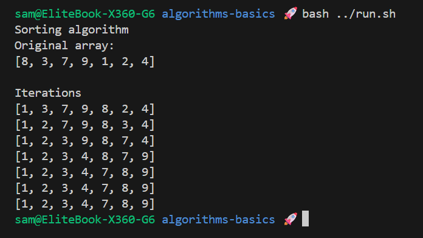
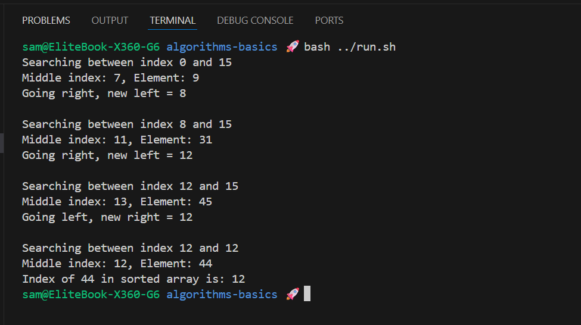

# Algorithms Basics

Short examples of basic algorithms in Java: a simple selection-based sorting routine and a binary search implementation.

## Challenge

**From:** Java Programming MOOC Part 7

**Motive** Practice working with algorithms.

## Class Structure

| Class          | Responsibility                                      |
| :------------- | :-------------------------------------------------- |
| `Sorter`       | Sorts an array (prints array after each pass)       |
| `BinarySearch` | Searches a sorted array and prints search steps     |
| `Helper`       | Small utility methods (swap, indexOfSmallest, etc.) |
| `Program`      | Demo entry point that runs the examples             |

## Features

- Selection-style sorting with step output
- Binary search that sorts first and shows the search range
- Small helper utilities for clarity and reuse

## Usage

Run `Program` to see the sort iterations and binary search steps printed to the console.

## Output Example

