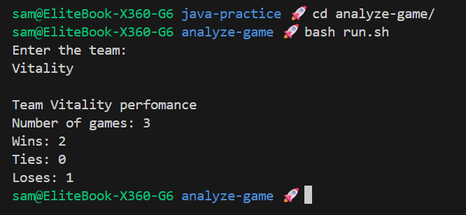

# Game Statistics Analyzer

A Java program that reads game statistics from a CSV file and displays team performance data.

## Challenge

**From:** Java Programming MOOC - Part 4

**Task:** Create a program that reads match statistics from a file and displays wins, losses, and ties for a specified team.

## Features

- Reads game data from CSV file
- Analyzes team performance (wins, ties, losses)
- Handles file I/O with proper error handling
- User-friendly command-line interface

## Output Example

