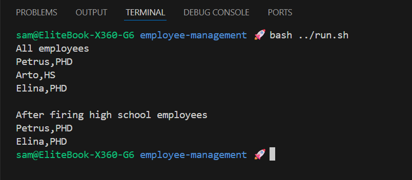

# Employee Management

A small example demonstrating a collection of `Person` objects, filtering by education level and removing (firing) employees.

## Challenge

**From:** Java Programming MOOC Part 10 (subsection 3)

**Targetted Areas:** Practice working enumerators and iterators.

## Class Structure

| Class       | Responsibility                                         |
| :---------- | :----------------------------------------------------- |
| `Person`    | Data holder: name and `Education`                      |
| `Employees` | Holds a list of `Person`, supports add, print, fire    |
| `Education` | Enum of education levels (`PHD`, `MA`, `BA`, `HS`)     |
| `Program`   | Demo entry point that shows add, print, and fire flows |

## Features

- Add single `Person` or a list of `Person` objects
- Print all employees or only those matching an `Education` level
- Remove (fire) employees by `Education` using an iterator-safe removal

## Output Example

