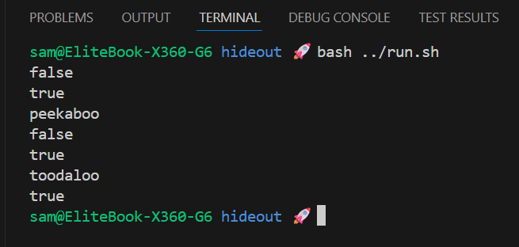

# Hideout (Generics)

Practice working with generic types by implementing a `Hideout<T>` that can store and retrieve items of any type.

## Challenge

**From:** Java Programming MOOC Part 12 (subsection 1)

**Purpose:** Practice working with generic types.

## Class Structure

| Class     | Responsibility                                                                  |
| :-------- | :------------------------------------------------------------------------------ |
| `Hideout` | Generic container (`T`) with `putIntoHideout`, `takeFromHideout`, `isInHideout` |
| `Program` | Demo that uses `Hideout<String>` and prints results                             |

## Features

- Generic storage with type parameter `T`
- Toggle-style `putIntoHideout` (adds if not present, removes if present)
- Safe `takeFromHideout` returning `null` when empty
- `isInHideout` indicates presence of items

## Output Example

