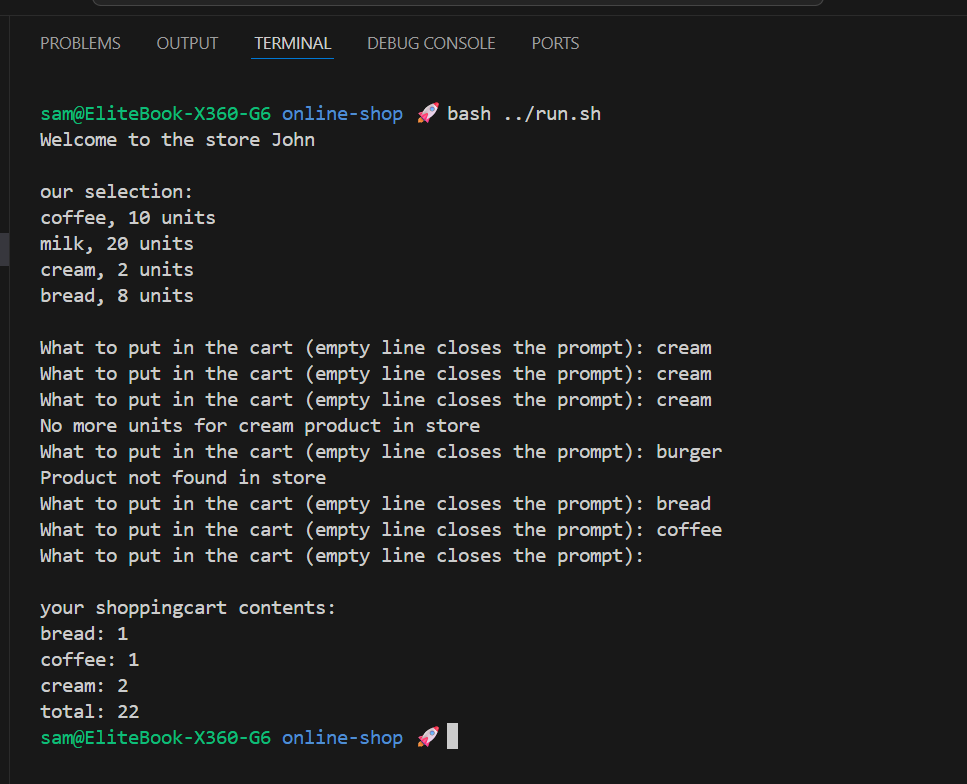

# Online Shop

A small command-line shop simulation demonstrating product storage, a shopping cart, and a simple store UI.

## Challenge

**From:** Java Programming MOOC Part 9 (subsection 2)

**Task:** Implement a `Warehouse` that holds `Product` objects and stock counts, a `Store` that accepts customer input, and a `ShoppingCart` that collects `Item`s and computes total price.

## Class Structure

| Class          | Responsibility                                     |
| :------------- | :------------------------------------------------- |
| `Warehouse`    | Stores `Product`s, tracks stock, provides prices   |
| `Product`      | Product data holder (name, price, stock)           |
| `Store`        | Console shop UI: lists selection and handles input |
| `ShoppingCart` | Collects `Item`s, computes total and prints cart   |
| `Item`         | Cart item (product name, quantity, unit price)     |

## Features

- List available products and their units
- Add products to cart by typing the product name
- Prevent adding when stock is depleted (`Warehouse.take`)
- Print cart contents and total price

## Output Example

