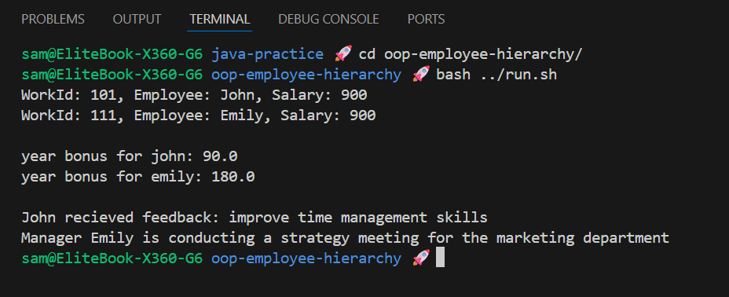

# Enhanced Employee Hierarchy

A Java exercise to practice the basics of Object-Oriented Programming (OOP).

## Challenge

**From:** Custom practice after Java MOOC part 5

**Task:** Design and implement a simple two-level employee hierarchy to demonstrate how subclasses extend and modify the behavior of a parent class.

## Class Structure

| Class    | Key Concept            | Unique/Overridden Method Examples                 |
| :------- | :--------------------- | :------------------------------------------------ |
| Employee | Base Class             | calculateYearlyBonus() (Default)                  |
| Manager  | Subclass + Overloading | calculateYearlyBonus() (Higher), conductMeeting() |

## Output Example

