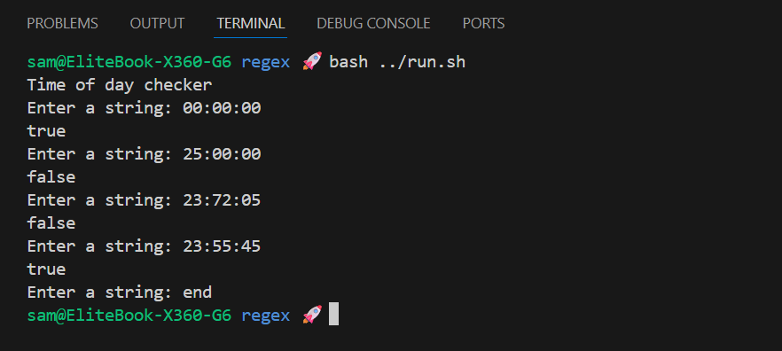

# Regex Checkers

Small exercises demonstrating simple regular-expression based validators in Java.

## Challenge

**From:** Java Programming MOOC Part 10

## Class Structure

| Class     | Responsibility                                                                   |
| :-------- | :------------------------------------------------------------------------------- |
| `Checker` | Provides validator methods using regex (`isDayOfWeek`, `allVowels`, `timeOfDay`) |
| `Program` | Simple interactive demo that uses `Checker.timeOfDay`                            |

## Validator Methods (`Checker`)

- `isDayOfWeek(String)` — returns true for `mon`, `tue`, `wed`, `thu`, `fri`, `sat`, `sun`.
- `allVowels(String)` — returns true when the entire string consists only of vowels (`a,e,i,o,u`) of the same length.
- `timeOfDay(String)` — validates `HH:MM:SS` time in 24-hour format (hours 00–23, minutes/seconds 00–59).

## Output Example

