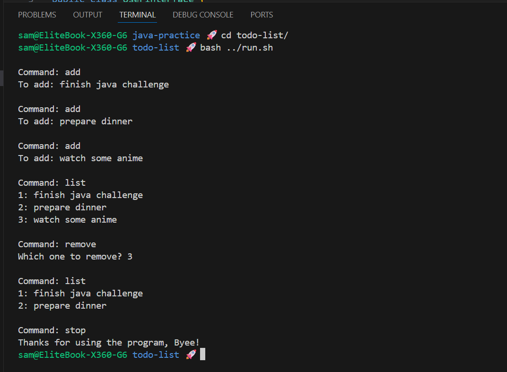

# Simple Todo List

A small Java program implementing a command-line todo list and a basic user interface.

## Challenge

**From:** Java Programming MOOC Part 6

**Task:** Implement a `TodoList` that stores tasks and a `UserInterface` that allows the user
to add, remove and list tasks from the command line. The `Program` class wires the pieces
together and starts the UI.

## Class Structure

| Class           | Responsibility                                      |
| :-------------- | :-------------------------------------------------- |
| `TodoList`      | Stores tasks, add/remove/print operations           |
| `UserInterface` | Reads commands from the user and invokes `TodoList` |
| `Program`       | Entry point: creates objects and starts UI          |

## Features

- Add tasks via `add` command
- Remove tasks by number via `remove` command
- List tasks with `list` command
- Stop the program with `stop`

## Usage

Run `Program` and use the following commands when prompted:

- `add` — add a new task
- `remove` — remove an existing task by its number
- `list` — show all tasks
- `stop` — exit the program

## Output Example

